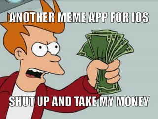
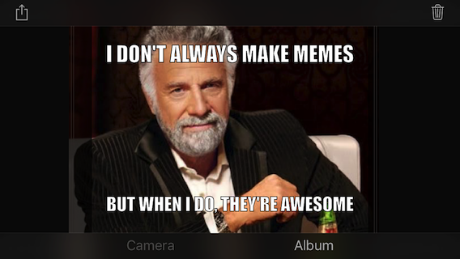
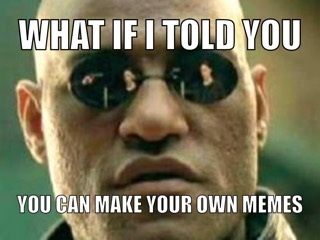
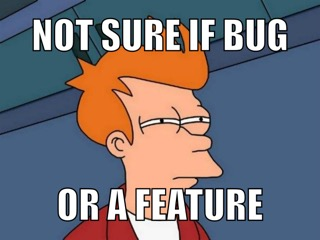

# MemeMe

MemeMe 2.0 iOS app for Udacity nanodegree

Luke Van In 2016-01-09

Make memes. Supports portrait and landscape mode on iPhone and iPad.

## Notes:

- See history of created memes. Switch between grid and list views.
- Share button becomes enabled when meme is complete (image and both text fields are filled). Tap on the share button to show the activity controller for sharing the image. The image is sent to the view controller delegate on completion.
- Cancel button becomes enabled when any content is provided (image or either text field). Tap cancel button to clear content and revert to default state.
- Meme image maintains aspect ratio independently of device size and orientation. Image is scaled to fit screen width in portrait mode, and screen height in landscape mode.

## Known issues:

- None. It's perfect! :-P

## TODO:

- Persist memes so that they are available after the app is restarted.
- Export images at higher resolution. Currently uses the default view size, which is device dependent, and does not account for retina scale.
- Maintain relative scale and offset for image when the device is rotated. Currently uses absolute point offset which does not account for difference in view size.
- Allow user to select a different font.
